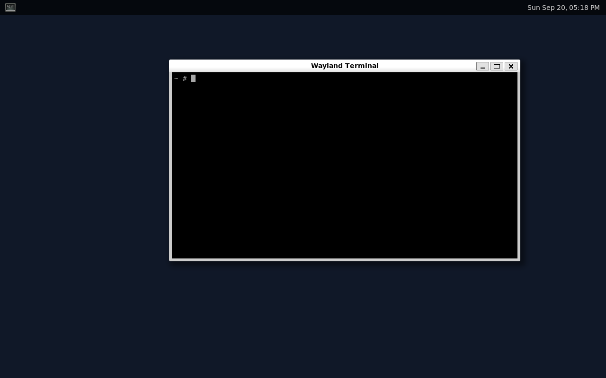

# master penguin linux

A Linux system built from source, one layer at a time — kernel, userland, init,
and eventually a bootable image. Not a fork of anything: the kernel and BusyBox
come straight from upstream, everything around them is written here.

**Status:** there are two tracks, and both work.

*Hand-built* — kernel, BusyBox initramfs, an ext4 root and `mpinit`, our own PID 1
in about 300 lines of C. Every layer assembled by hand. Boots to a shell in ~1.5s.

*Desktop* — the same `mpinit` as PID 1, with Buildroot supplying the cross
toolchain and a Wayland stack around it. Boots to a Weston desktop.



```
[initramfs] root device: /dev/vda
[initramfs] handing over to /sbin/init

===========================================
        master penguin linux
===========================================
Linux 6.18.52
root : /dev/vda (rw,relatime)
init : /sbin/mpinit (pid 1)
boots: 3 (persisted on disk)
===========================================
root@master-penguin:~#
```

## The two tracks

|  | hand-built | desktop |
|---|---|---|
| build | `./build.sh` | `./build-desktop.sh` |
| boot | `./boot.sh` | `./boot-desktop.sh` |
| toolchain | the host compiler | Buildroot cross toolchain (gcc + glibc) |
| userland | BusyBox, static | BusyBox + Wayland, shared glibc |
| boot chain | initramfs, then `switch_root` | kernel mounts the root directly |
| PID 1 | `src/mpinit.c` | `src/mpinit.c` — the same file |
| build time | ~10 min | ~70 min the first time |

The hand-built track is where the learning is: nothing is hidden, and every layer
is small enough to read in one sitting. It stops short of a desktop on purpose —
a graphical stack means a cross toolchain, a full libc, mesa, and forty-odd
libraries underneath the compositor, which is weeks of work by hand and teaches
progressively less per hour.

So the desktop track hands that part to Buildroot and keeps what is ours: `mpinit`
is built as a Buildroot package from the very same source, and everything under
`buildroot/board/rootfs-overlay/` is this system, not Buildroot's.

## Requirements

A Linux host (WSL2 is fine) with:

```sh
sudo apt install build-essential flex bison bc libssl-dev libelf-dev \
                 libncurses-dev cpio wget xz-utils file qemu-system-x86
```

For hardware acceleration, add yourself to the `kvm` group — `sudo usermod -aG kvm $USER`,
then start a new session. Without it QEMU falls back to software emulation, which
still works, just slower.

## Quick start

```sh
./build.sh          # fetch + compile kernel and busybox  (~10 min, ~2.8 GB)
./mkrootfs.sh       # compile mpinit, build the ext4 root image
./mkinitramfs.sh    # pack the bootstrap initramfs
./boot.sh           # boot it under QEMU     (quit: Ctrl-A then X)
```

Re-running `build.sh` is cheap — it skips anything already downloaded or configured.
Day to day only the last three matter, and each takes about a second:

```sh
vi rootfs/etc/init.d/rcS && ./mkrootfs.sh && ./boot.sh
```

Builds land in `$WORKDIR` (default `~/work`), never inside the repo. On WSL, keep
that on the distro's own ext4 — building under `/mnt/c` or `/mnt/d` goes through
the 9p filesystem and turns a 10-minute kernel build into an hour.

## Desktop quick start

```sh
./build-desktop.sh     # buildroot: toolchain, kernel, wayland, weston  (~70 min)
./boot-desktop.sh      # opens a window (WSLg or any X/Wayland display)
```

Useful variants:

```sh
KERNEL_EXTRA=autoterm ./boot-desktop.sh     # open a terminal on the desktop at boot
./boot-desktop.sh --headless                # no window; screenshot over the QEMU monitor
```

Headless mode puts the QEMU monitor on a unix socket, so a screenshot is:

```sh
echo "screendump /tmp/shot.ppm" | socat - UNIX-CONNECT:/tmp/mp-monitor.sock
```

After editing the init or anything in the overlay, only the image needs rebuilding:

```sh
cd "$WORKDIR/br-desktop" && make mpinit-rebuild all
```

Weston runs on the **pixman** software renderer. Without `libegl`/`libgbm`/`libgles`
present, Buildroot configures weston with `-Drenderer-gl=false`, which means mesa
— and therefore LLVM — never has to be built. That is most of an hour saved, and
under QEMU the rendering was going to be on the CPU either way. Enable
`BR2_PACKAGE_MESA3D` with the llvmpipe gallium driver to get GL back.

## Running it in VirtualBox

The desktop build produces two bootable artifacts:

| | |
|---|---|
| `rootfs.iso9660` | a live CD, ~42 MB, bootable under **both EFI and BIOS** firmware. Attach it as an optical drive and boot — nothing to convert. The root filesystem is the initramfs, so it runs in RAM and is writable. |
| `disk.img` | a whole disk: MBR, GRUB, one ext4 partition. Boots on its own anywhere, but VirtualBox needs it converted to VDI first. |

The ISO is the easier one:

```sh
wsl -d Ubuntu -- cp ~/work/br-desktop/images/rootfs.iso9660 /mnt/g/VirtualDisk/master-penguin-linux.iso
```

Then in VirtualBox: create a VM, attach the ISO to the optical drive, boot. No
hard disk needed at all.

### The disk image

```sh
# copy it out of WSL with cp -- a PowerShell redirect corrupts binary streams
wsl -d Ubuntu -- cp ~/work/br-desktop/images/disk.img /mnt/g/VirtualDisk/master-penguin-linux.img
```

VirtualBox cannot attach a raw image, so convert it first. The VDI is
dynamically allocated, so it shrinks to what is actually used — 769 MB of raw
image becomes about 85 MB:

```powershell
VBoxManage convertfromraw master-penguin-linux.img master-penguin-linux.vdi --format VDI
```

`make-vbox-vm.ps1` does the conversion and builds the VM around it:

```powershell
powershell -ExecutionPolicy Bypass -File .\make-vbox-vm.ps1 -Start
```

The VM settings are not arbitrary — each one matches a driver compiled into this
kernel: **SATA (AHCI)** for `CONFIG_SATA_AHCI`, **VMSVGA** for `CONFIG_DRM_VMWGFX`,
a **USB tablet** for `CONFIG_USB_HID`, and an **Intel 82540EM** NIC for
`CONFIG_E1000`. The QEMU board config assumes virtio for all of those, so
`buildroot/board/linux-pc.config.fragment` adds the plain-PC hardware alongside
it. One kernel, both machines.

`root=` is a `PARTUUID`, fixed by pinning the MBR disk signature in
`genimage.cfg`. That way the same image boots whether the disk appears as
`/dev/sda` on VirtualBox's SATA controller or `/dev/vda` on QEMU's virtio one.
The GRUB menu also carries explicit `/dev/sda1` and `/dev/vda1` entries as a
fallback.

## Layout

| path | what it is |
|---|---|
| `config.sh` | versions and paths — the only place to bump the kernel |
| `build.sh` | downloads and compiles kernel + BusyBox |
| `mkrootfs.sh` | builds `rootfs.ext4` from `rootfs/` + BusyBox |
| `mkinitramfs.sh` | packs `initramfs/init` + BusyBox into a cpio archive |
| `boot.sh` | runs QEMU, with KVM when available |
| `src/mpinit.c` | **PID 1** — the init this system actually runs |
| `initramfs/init` | PID 1 *in the initramfs* — finds the root disk, then `switch_root` |
| `rootfs/` | root filesystem skeleton for the hand-built track |
| `buildroot/` | BR2_EXTERNAL tree: the mpinit package, the defconfig, the overlay |
| `build-desktop.sh` `boot-desktop.sh` | the desktop track |
| `make-vbox-vm.ps1` | raw image to a ready-to-run VirtualBox VM |

## How the boot works

```
QEMU/SeaBIOS
  -> bzImage
     -> unpack initramfs into RAM
        -> exec /init                     (initramfs/init)
           -> mount /dev/vda ro
           -> mount --move /dev
           -> switch_root                 (initramfs is deleted here)
              -> /sbin/init               (busybox)
                 -> /etc/inittab
                    -> sysinit: /etc/init.d/rcS
                    -> respawn: -/bin/sh
```

The initramfs is now a bootstrap and nothing else. It exists because at the moment
the kernel finishes booting, nothing knows how to reach the root filesystem yet —
on a real machine that means loading disk and RAID drivers, decrypting LUKS, or
finding an LVM volume. Here it only has to mount `/dev/vda`, but the shape is the same.

`switch_root` then *deletes* the initramfs to reclaim the RAM and execs the real
`/sbin/init` as PID 1. That is why `/dev` has to be moved across first: the new root
has an empty `/dev`, and init cannot even open `/dev/console` to report a failure.

Unlike stage 1, this root survives reboots — `boots:` in the banner counts them,
and the record is in `/var/log/boot.log` on the disk image.

## init

`src/mpinit.c` replaces BusyBox init. It is deliberately small, and it exists to
make the three obligations of PID 1 concrete:

**It may never exit.** If PID 1 returns, the kernel panics immediately. Every
path through the file either loops or calls `reboot()`.

**It reaps whatever it is given.** When a process dies its children are
reparented to PID 1. A single blocking `waitpid(-1, ...)` collects them all —
services it started, and orphans it has never heard of. Skip that and zombies
accumulate until nothing can fork.

**It supervises.** Services come from `/etc/mpinit.conf`:

```
sysinit /etc/init.d/rcS       run once, to completion, before anything else
respawn /bin/sh               keep running, with a controlling terminal
daemon  /usr/bin/start-weston keep running, without one
```

`respawn` and `daemon` differ in exactly one thing: whether the service is given
a controlling terminal. Only one session can own the console at a time, so
handing it to everything means services stealing it from each other. A shell
needs it for job control; a compositor talking to DRM does not.

Respawns are throttled — more than five restarts in ten seconds and it backs
off, so a service that dies on startup cannot spin the CPU forever.

Shutdown follows the BusyBox signal convention, so `poweroff`, `halt` and
`reboot` keep working: SIGUSR1 halts, SIGUSR2 powers off, SIGTERM reboots, and
Ctrl-Alt-Del arrives as SIGINT because init asks for it with `RB_DISABLE_CAD`.
Each one stops every process, syncs, remounts `/` read-only and calls `reboot()`.

There is a self-test for all of this. Boot with `KERNEL_EXTRA=selftest ./boot.sh`
and `/root/selftest.sh` checks that PID 1 is mpinit, that an orphan is reparented
to it, that no zombies survive, and that killing the supervised shell brings a new
one back — then powers off, which exercises the shutdown path too.

BusyBox init is still in the image as a fallback: `KERNEL_EXTRA=init=/bin/init ./boot.sh`
boots it from `/etc/inittab` instead.

## Roadmap

- [x] **1** — kernel + BusyBox initramfs, boots to a shell
- [x] **2** — real ext4 root on a disk image, `switch_root` out of the initramfs
- [x] **3** — hand-written init (PID 1 in C): reap orphans, supervise services
- [x] **desktop** — Weston on Wayland, with Buildroot supplying the toolchain

Hand-built track, if it is ever worth going back to:

- [ ] two-pass cross toolchain, so the system can rebuild itself
- [ ] package manager and build recipes
- [ ] bootloader + bootable ISO

Desktop track:

- [ ] mesa + llvmpipe, for GL clients
- [ ] a real application or two, and a launcher for them
- [ ] persistent home, and an installer that writes to a disk
- [x] a self-booting disk image (GRUB + MBR) that runs in VirtualBox
- [ ] boot it on actual hardware

## Notes

Things that cost time, written down so they only cost it once:

- **`mount -o remount,rw /` needs `/proc` already mounted.** BusyBox `mount` reads
  `/proc/mounts` to work out what it is remounting. Put `mount -t proc proc /proc`
  first in `rcS`, or the root silently stays read-only.
- **Build the ISO for EFI as well as BIOS.** VirtualBox, and most hypervisors,
  now default new Linux VMs to EFI firmware, which cannot see an El Torito BIOS
  boot image at all — the ISO looks blank and the VM drops to a boot prompt with
  no error worth reading. `BR2_TARGET_GRUB2_X86_64_EFI=y` alongside
  `BR2_TARGET_GRUB2_I386_PC=y` covers both. Test on the firmware the person
  actually has, not the one the test script sets.
- **The ISO and the disk need separate GRUB core images.** The prefix baked into
  a core image names the device it will be read from — `(cd)` for one,
  `(hd0,msdos1)` for the other — and Buildroot builds only one. Trying to make a
  single image serve both, with an embedded config that searches for its own
  grub.cfg, fails on the ISO: `$root` stays at hd0 and the kernel load dies with
  "cannot get C/H/S values". `board/post-image.sh` builds the second one instead.
- **The QEMU board kernel config has `CONFIG_BLK_DEV_INITRD` off.** It only ever
  boots from a disk, so it has no reason to carry it. The symptom is thoroughly
  misleading: GRUB loads the initrd without complaint, the kernel discards it in
  silence, `rdinit=/sbin/init` then fails with -2 because nothing was unpacked,
  and the panic that follows blames a missing root filesystem. Hours can go into
  debugging GRUB for this.
- **`BR2_TARGET_GRUB2_INSTALL_TOOLS=y` is not optional when using genimage.**
  Without it grub2 leaves `boot.img` in its build directory and never installs it
  into the target, which is where a post-build script has to pick it up to write
  the MBR.
- **`BR2_INIT_NONE` means *none*.** No init scripts, and no `/etc/fstab` either.
  `mount -a` then mounts nothing, `/sys` never appears, and weston fails with
  `no drm device found` — while `/dev/dri/card0` exists and works fine, because
  devtmpfs is mounted by the kernel. libudev enumerates by walking `/sys`, not by
  reading udevd's database, so no `/sys` means no devices at all.
- **`BR2_PACKAGE_EUDEV=y` does nothing on its own.** It hangs off the /dev
  management choice, so the symbol to set is
  `BR2_ROOTFS_DEVICE_CREATION_DYNAMIC_EUDEV`. Weston `depends on
  BR2_PACKAGE_HAS_UDEV`, so getting this wrong drops weston from the build with
  no error at all. Check the generated `.config` before starting a long build.
- **Buildroot refuses to run if `$PATH` contains a space.** On WSL the Windows
  PATH is appended automatically, which guarantees one. `build-desktop.sh` filters
  those entries out rather than changing `/etc/wsl.conf`.
- **Ubuntu 26.04 ships uutils coreutils as the default `install`**, which
  Buildroot rejects (uutils/coreutils#12166). GNU install is on disk as
  `gnuinstall`; `build-desktop.sh` checks for this and prints the
  `update-alternatives` lines to fix it.
- **Do not give a sysinit script a controlling terminal.** When a session leader
  that owns one exits, the kernel runs `disassociate_ctty()`, and on the console
  that vhangup throws away output still queued. A boot script losing its last
  few printed lines is a miserable thing to debug. `mpinit` hands a ctty to
  respawn services only.
- **A backgrounded job in a script dies with the script.** No job control means
  `cmd &` stays in the same process group, which gets SIGHUP when the session
  leader exits. `setsid cmd &` escapes it.
- **`/proc/self` is whoever does the reading.** `$(cat /proc/self/stat)` reports
  `cat`, not the shell that called it. To check who adopted an orphan, record its
  pid and read `/proc/<pid>/stat` from outside.
- **BusyBox picks its applet from `basename(argv[0])`.** Exec'ing `/bin/busybox`
  as init just prints its help and exits — instant panic. The fallback symlink
  has to be named `init`.
- **`mkrootfs.sh` destroys the disk.** It rebuilds `rootfs.ext4` from scratch every
  run, so anything written inside the guest is gone. `rootfs/` in git is the source
  of truth; the image is a build artifact. Skip `mkrootfs.sh` and just `./boot.sh`
  when you want to keep what is in there.
- **Killing QEMU is a power cut.** Writes sit in the guest page cache and vanish;
  `poweroff` inside the guest runs the `::shutdown` line in `inittab` and unmounts
  cleanly. Anything that must survive a hard kill needs an explicit `sync`.
- **`mke2fs -d` builds the image from a directory** — no loop mount, no root. It
  cannot create device nodes, which is fine here because `/dev` is moved in from
  the initramfs.
- **BusyBox `oldconfig` kills the build.** `yes "" | make oldconfig` — `yes` takes
  SIGPIPE when `oldconfig` stops reading, `set -o pipefail` turns that into a
  pipeline failure, and `set -e` aborts. Relax `pipefail` around that one line.
- **Kernel `make bzImage`, not `make`.** `defconfig` marks hundreds of drivers `=m`
  and none of them are needed for this. `VIRTIO_BLK` and `EXT4_FS` are already
  built in, so no custom config is needed yet.
- **`cttyhack` breaks piped input.** Only the initramfs rescue shell uses it now;
  under BusyBox init, `-/bin/sh` in `inittab` gets a proper controlling terminal.
